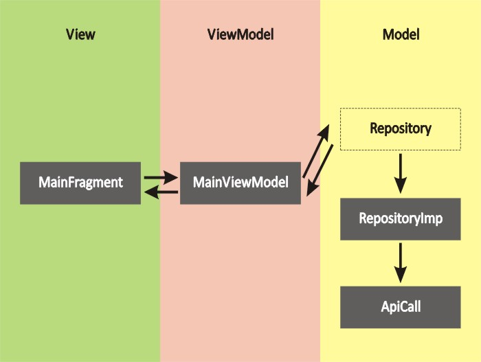
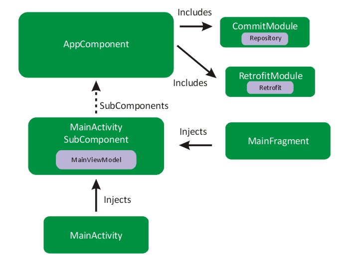
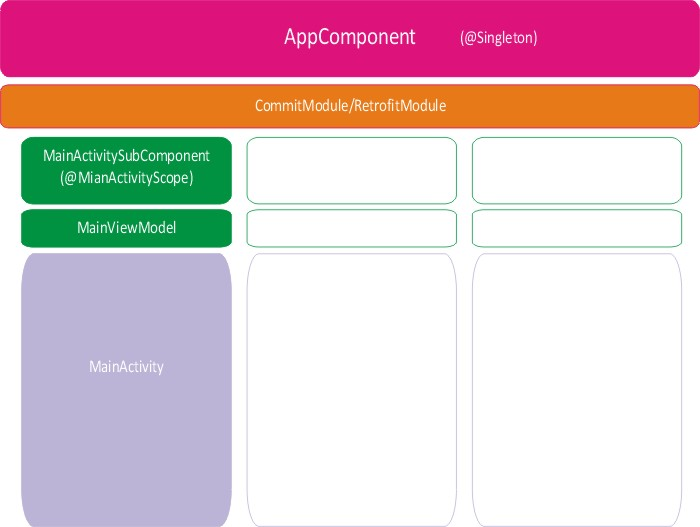

## General Motors Coding Challenge

This repository contains a detailed sample app that implements using Java, MVVM architecture (ViewModel, LiveData, DataBinding, ViewBinding and Navigation Component), Dagger, RxJava, RxAndroid, Retrofit, OkHttp3.

  

# Architecture Blueprint

  
   

  
# Dagger Dependency Graph

  
   

# Dagger Dependency Graph with Scope

  
   

### The app has following packages:
1. **di**: It contains the Dagger (dependency injection) related packages, like component, sub component, module and scope.
2. **model**: It contains all the data accessing and manipulating components.
3. **network**: Contains Api urls, network exception, custom response object and status of request.
4. **repository**: Repository is bridge between viewmodel and data. It is responsible for get accessing data from internet using network package.
5. **ui**: It contains Activities, Fragments and adapter.
6. **viewmodel**: MianViewModel, a bridge between view and repository.

### Library reference resources:
1. Github api for list of commits: https://developer.github.com/v3/repos/commits/
2. Dagger: https://developer.android.com/training/dependency-injection/dagger-android
3. Navigation Component: https://developer.android.com/guide/navigation/navigation-getting-started
4. DataBinding: https://developer.android.com/topic/libraries/data-binding
5. ViewBinding: https://developer.android.com/topic/libraries/view-binding
6. RxJava2: https://github.com/amitshekhariitbhu/RxJava2-Android-Samples
7. RxAndroid: https://medium.com/crunching-rxandroid/crunching-rxandroid-intro-c27eb6f009ea
8. Retrofit: https://github.com/square/retrofit
9. OkHttp3 (Interceptor): https://github.com/square/okhttp
10. OkHttp3 (No Network Connection Interceptor): https://medium.com/programming-lite/retrofit-2-handling-network-error-defc7d373ad1

### Testing
  1. MainViewModel test
  
### Testing Libraries
  1. JUnit 4: https://github.com/junit-team/junit4
  2. Mokito: https://github.com/mockito/mockito
